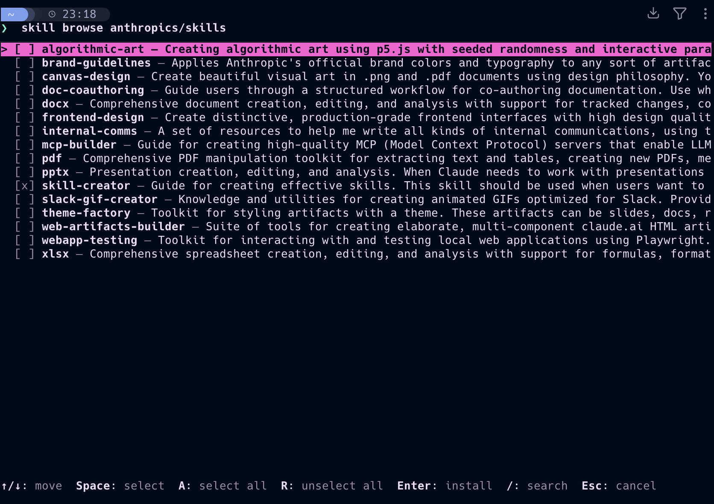
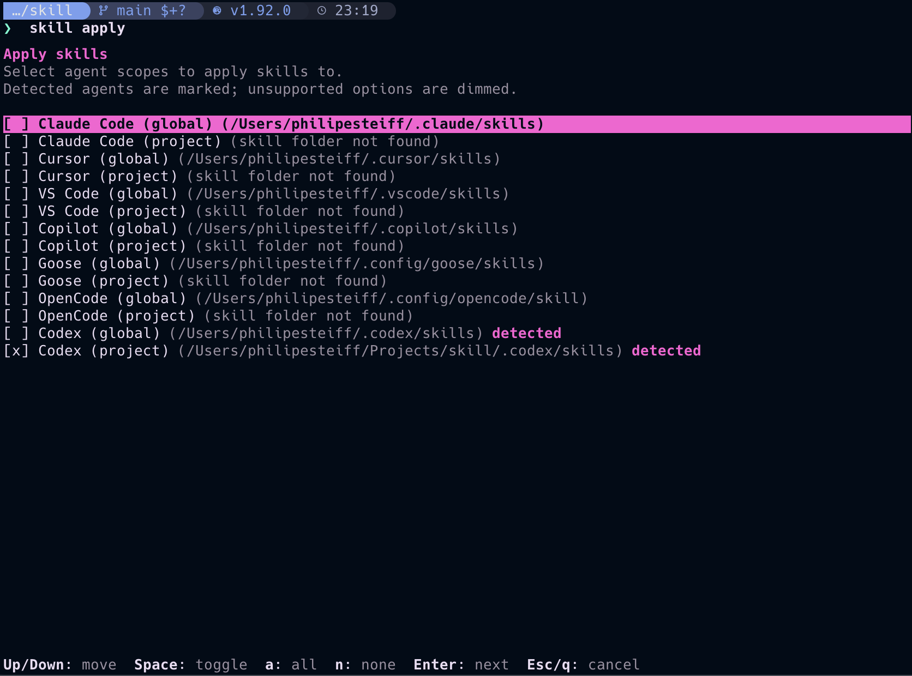
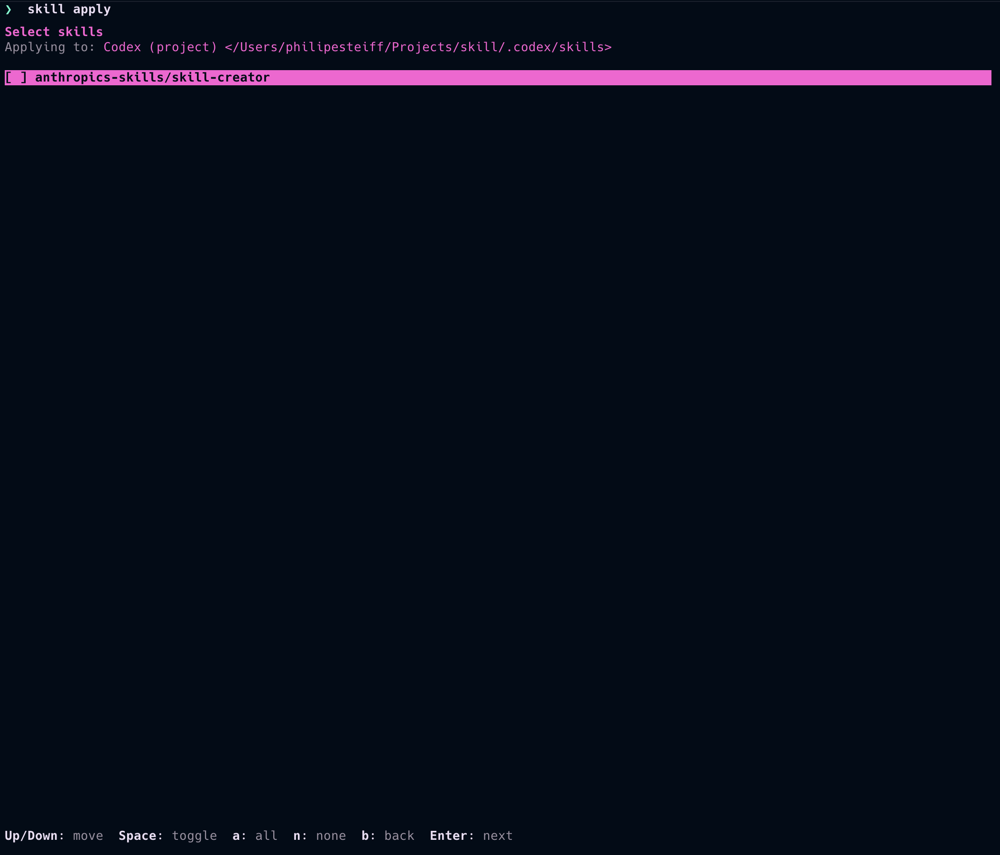

```
 (`-').-><-.(`-')  _                       
 ( OO)_   __( OO) (_)      <-.      <-.    
(_)--\_) '-'. ,--.,-(`-'),--. )   ,--. )   
/    _ / |  .'   /| ( OO)|  (`-') |  (`-') 
\_..`--. |      /)|  |  )|  |OO ) |  |OO ) 
.-._)   \|  .   '(|  |_/(|  '__ |(|  '__ | 
\       /|  |\   \|  |'->|     |' |     |' 
 `-----' `--' '--'`--'   `-----'  `-----'
```

Manage agent “skills” from GitHub repos: browse, install, sync updates, uninstall, and apply them to your projects individually. 

## Features
- Browse skills in a repo with an interactive TUI (search + multi-select)
- Install selected skills pinned to a commit (reproducible installs)
- Sync a trusted source to install missing skills and update installed ones
- Browse installed skills and uninstall them from a TUI
- Apply installed skills to supported agents (Claude Code, Cursor, VS Code, Copilot, Goose, OpenCode, Codex)

## Installation
Requirements: `git` and an interactive terminal.

macOS (Homebrew):
```bash
brew tap philipesteiff/tap
brew install skill
```

macOS (curl installer):
```bash
curl -fsSL https://raw.githubusercontent.com/philipesteiff/skill/main/scripts/install.sh | bash
```

From source (any OS with Rust):
```bash
cargo install --git https://github.com/philipesteiff/skill --locked --bin skill
```

## Usage
Skill scans `SKILL.md` files recursively, including repository root (for single-skill repos).

Browse a repo and install skills:
```bash
skill browse owner/repo
```


Browse installed skills and uninstall (select skills → Enter):
```bash
skill browse
```

Sync updates from a source:
```bash
skill sync 
```

Apply installed skills to agent directories (TUI):
```bash
skill apply
```




Applied skills are copied as real folders (not symlinks).
Running `skill sync` refreshes applied copies when installs update.

In the skills step, press `g` to toggle Git tracking per skill (project targets in a Git repo).
The default is `not tracked`.
`not tracked` skills are written to local `.git/info/exclude`, so personal preferences stay local and are not committed.

## Configuration
By default, Skill stores data under `~/.skill`.

To override the base directory:
```bash
export SKILLS_HOME=/path/to/dir
```

## Contributing
- Install Rust (stable) and `git`.
- Run locally:
  - `cargo build`
  - `cargo test`
  - `cargo clippy --all-targets --all-features`
  - `cargo fmt`

Pull requests are welcome. 

## License
Apache-2.0. See `LICENSE`.
