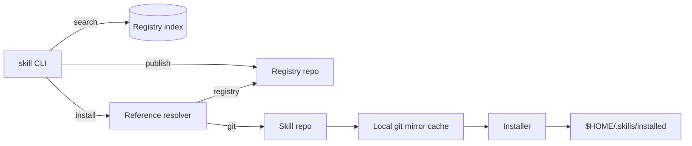

# skill

A GitHub-only CLI for installing, updating, and publishing Agent Skills (`SKILL.md`) with optional registry indexing. Installs are pinned to commit SHAs for reproducibility.

## 10-minute mental model
Think of the tool as three simple loops:
1) **Find** skills: a registry repo provides lightweight metadata for fast search.
2) **Fetch** skills: the CLI resolves a reference to a repo + path + commit, then copies that folder locally.
3) **Publish** skills: the CLI updates registry metadata via a PR; skill content never leaves its repo.

Everything lives in git. There is no central service.

## Architecture at a glance


## Core components (what they do)
- **Registry repo**: stores metadata JSON only (name/description/tags/version/commit/path). No `SKILL.md` bodies.
- **Registry index**: local SQLite index built from registry JSON files for fast offline search.
- **Resolver**: parses user refs (registry ref, GitHub shorthand, or git URL) and resolves to a commit + path.
- **Git mirror cache**: local bare mirrors to avoid re-cloning and to keep bandwidth low.
- **Installer**: extracts a single skill folder at a specific commit and writes it to `$HOME/.skills/installed`.
- **Lockfile**: tracks what was requested and what commit/version was installed.

## End-to-end flow (what happens under the hood)
### Search
1) `skill search <query>` hits the local registry index.
2) Results are printed; nothing is downloaded.

### Install
1) Parse the ref and resolve to `(repo_url, path, commit)`.
2) Fetch the commit into the local mirror (no full clone).
3) Extract only the skill directory.
4) Validate `SKILL.md` frontmatter (name, description, and directory match).
5) Copy the skill into `$HOME/.skills/installed/<namespace>/<name>/<version-or-latest>`.
6) Update `lock.json`.

### Upgrade
1) Sync registries (if configured).
2) For each `@latest` entry in `lock.json`, resolve the newest commit.
3) Reinstall if the commit changed.

### Publish
1) Scan the current repo for `SKILL.md` files.
2) Validate and read metadata (version/tags/namespace).
3) Update registry JSON entries and create a PR.

## Reference formats
```text
registry: namespace/name/path[@latest|@1.2.0]
github:   owner/repo/skill-name[@latest]
git url:  https://github.com/owner/repo.git#path/to/skill[@latest]
```
If a repo contains multiple skills and no path is provided, the CLI can install all or use `--pick` for a TUI selection.

## Local data layout
```
$HOME/.skills/
  registry/<registry-id>/repo/         # cloned registry repo
  registry/<registry-id>/index.sqlite  # search index
  registry/<registry-id>/head.txt      # last indexed commit
  cache/repos/<slug>.git               # bare mirror cache
  installed/<namespace>/<name>/<ver>/  # installed skill folders
  lock.json
```

## Skill format (what the CLI validates)
`SKILL.md` must start with YAML frontmatter and include:
- `name` (lowercase, hyphenated, matches folder name)
- `description`
Optional `metadata` can include `version`, `tags`, and `namespace`.
Invalid skills are skipped during repo installs and reported in the install logs/TUI.

## Installation
macOS (curl installer):
```bash
curl -fsSL https://raw.githubusercontent.com/philipesteiff/skill/main/scripts/install.sh | bash
```

Optional:
```bash
SKILL_VERSION=v0.0.9 curl -fsSL https://raw.githubusercontent.com/philipesteiff/skill/main/scripts/install.sh | bash
SKILL_INSTALL_DIR="$HOME/.local/bin" curl -fsSL https://raw.githubusercontent.com/philipesteiff/skill/main/scripts/install.sh | bash
```

Uninstall:
```bash
curl -fsSL https://raw.githubusercontent.com/philipesteiff/skill/main/scripts/uninstall.sh | bash
```

Homebrew:
```bash
brew tap philipesteiff/tap
brew install skill
```

## Usage
```bash
# Add a registry repo and sync
skill add-registry https://github.com/your-org/skills-registry.git
skill sync

# Search and install
skill search aws-lambda
skill install aws/skills/aws-lambda

# Install dependencies from skills.toml in the current directory
skill install

# Install with TUI picker when multiple skills exist
skill install owner/repo --pick

# Upgrade/remove/list
skill upgrade
skill remove aws/skills/aws-lambda
skill remove --all
skill list

# Apply installed skills to agent directories (TUI)
skill apply

# Publish metadata PR (requires GitHub token)
GITHUB_TOKEN=... skill publish --registry https://github.com/your-org/skills-registry.git
```

`skills.toml` format:
```toml
[dependencies]
aws-lambda = "aws/skills/aws-lambda@latest"
notes = { ref = "owner/repo/notes-skill", registry = "https://github.com/your-org/skills-registry.git" }
```

## Configuration
- Skills are stored in `$HOME/.skills` by default.
- Override the base path with `SKILLS_HOME`.
- Publishing uses `GITHUB_TOKEN` (or `GH_TOKEN`).

## Playground (offline, realistic testing)
```bash
just playground
export SKILLS_HOME=playground/work/home
skill add-registry file://$PWD/playground/work/skills-registry
skill sync
skill search echo
skill install acme/notes-skill
```

## Development
Prereqs: Rust toolchain, `git`, and optionally `just`.

```bash
just
just build
just run -- --help
just fmt
just clippy
just lint
just test
just release
just package
just install
just clean
```

## TUI
All commands use a `ratatui` + `crossterm` interface by default and require a compatible terminal.
