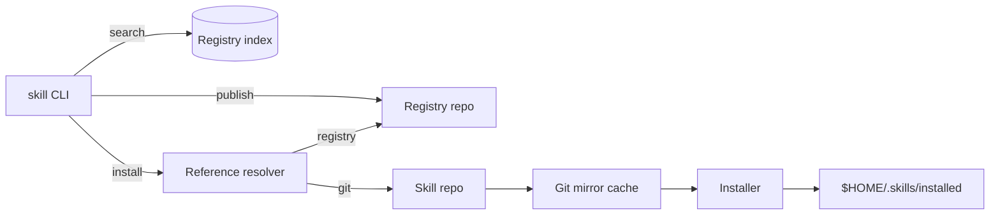

# skills

A GitHub-only CLI for installing, updating, and publishing Agent Skills (`SKILL.md`) with optional registry indexing. It pins installs to commit SHAs and works with both public and private repos via your existing git credentials.

## Features
- Registry search with local SQLite indexing
- Install from registry, GitHub shorthand, or full git URLs
- Upgrade/remove/list installed skills
- Publish metadata via PR to a registry repo
- Optional TUI picker (ratatui) when multiple skills are present

## How it works


## Install
From source:
```bash
cargo build --release
scripts/install.sh
```

## Usage
```bash
# Add a registry repo and sync
skill add-registry https://github.com/your-org/skills-registry.git
skill sync

# Search and install
skill search aws-lambda
skill install aws/skills/aws-lambda

# Install with TUI picker when multiple skills exist
skill install owner/repo --pick

# Upgrade/remove/list
skill upgrade
skill remove aws/skills/aws-lambda
skill list

# Publish metadata PR (requires GitHub token)
GITHUB_TOKEN=... skill publish --registry https://github.com/your-org/skills-registry.git
```

## Reference formats
```text
registry: namespace/name/path[@latest|@1.2.0]
github:   owner/repo/skill-name[@latest]
git url:  https://github.com/owner/repo.git#path/to/skill[@latest]
```

## Configuration
- Skills are stored in `$HOME/.skills` by default.
- Override the base path with `SKILLS_HOME`.
- Publishing uses `GITHUB_TOKEN` (or `GH_TOKEN`).

## Playground
Use the local playground to test against real git repos without hitting the network.
```bash
just playground
export SKILLS_HOME=playground/work/home
skill add-registry file://$PWD/playground/work/skills-registry
skill sync
skill search echo
```

## Development
Prereqs:
- Rust toolchain (stable)
- `git` in PATH
- `just` (optional, for task shortcuts)

Common tasks:
```bash
just
just build
just run -- --help
just fmt
just clippy
just lint
just test
just release
just package
just install
just clean
```

## TUI
Interactive selection uses `ratatui` + `crossterm` and requires a compatible terminal.
